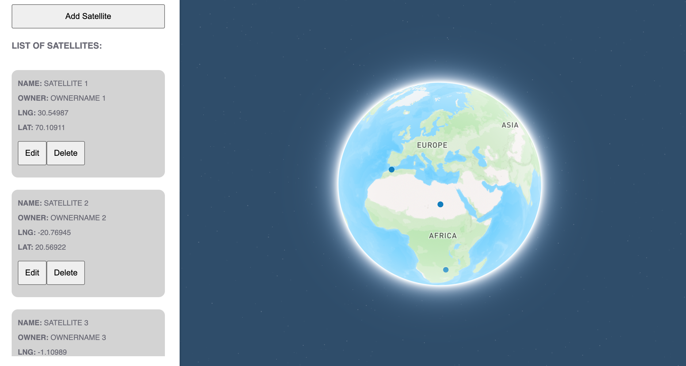

# ⚙ SatTrackerApp ⚙

## Overview
SatTrackerApp
- App to track custom satellites or any other orbital 3D objects (4fun)
- Edit/add/delete satellites
- Due to current app nature some components are more/less complex or basic implemented, for explain please chat with me
  
## TechStack
### FrontEnd
- JS/TS
- Remix/ReactJS
- Styled-components
- RTL/Jest (in progress)
- ThreeJS (in progress)

### BackEnd
- Maven (3.9.6)
- SpringBoot (CLI 3.2.0)
- Java (17.0.10)
- Docker (131620)
- MongoDB (in progress)

### Worked with
- Node.js (18.15.0)
- NPX (8.19.3)
- NPM (9.5.0)
- Chrome Version 118.0.5993.88  (Official Build) (x86_64)

## The Code / Installation

### Backend
1. Install backend `mvn clean package` (only for build jar/package first time, skip this step normally)
2. Run backend `mvn spring-boot:run`

You should see the API on http://localhost:1256/

### Frontend
1. Install repo `npm i`
2. Build project `npx remix build`
3. Replace `TOKEN_SECRET` in `.env` file to get Map access
4. Run project `npx remix dev` 

You should see the WebApp on http://localhost:3000/

### Docker
1. Run project `docker-compose up`

(If needed, build docker image and jar with `mvn spring-boot:build-image`)
